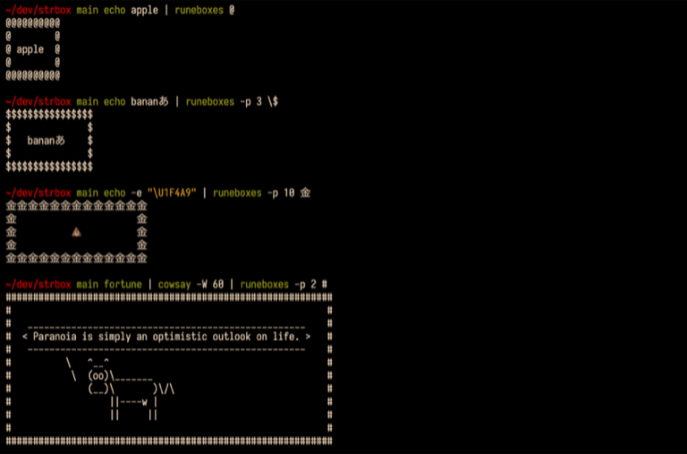

# runeboxes

Display the piped string in the character box.

### Image



### Required

runewidth command is required.  
runewidth "string" is return fixed width of the character "string".

I use [GitHub - mattn/go-runewidth: wcwidth for golang](https://github.com/mattn/go-runewidth) function as command line tool.  
See installation at <https://github.com/kis9a/go-runewidth#fork>

### Installation

```
install_path=/usr/local/bin/runeboxes
sudo curl -s https://raw.githubusercontent.com/kis9a/runeboxes/main/runeboxes > "$install_path"
chmod +x "$install_path"
```

### Usage

```
USAGE:
  runeboxes [options] <box_char>

OPTIONS:
  -h: help
  -p: padding

EXAMPLE:
  echo apple | runeboxes @
  echo banana | runeboxes -p 3 \$
  echo -e "\U1F4A9" | runeboxes 金
  fortune | cowsay -W 60 | runeboxes -p 2 #
```

### Inspired

[GitHub - ascii-boxes/boxes: Command line ASCII boxes unlimited!](https://github.com/ascii-boxes/boxes)

### Development

linter: [GitHub - koalaman/shellcheck: ShellCheck, a static analysis tool for shell scripts](https://github.com/koalaman/shellcheck)  
formatter: [GitHub - mvdan/sh: A shell parser, formatter, and interpreter with bash support; includes shfmt](https://github.com/mvdan/sh)
