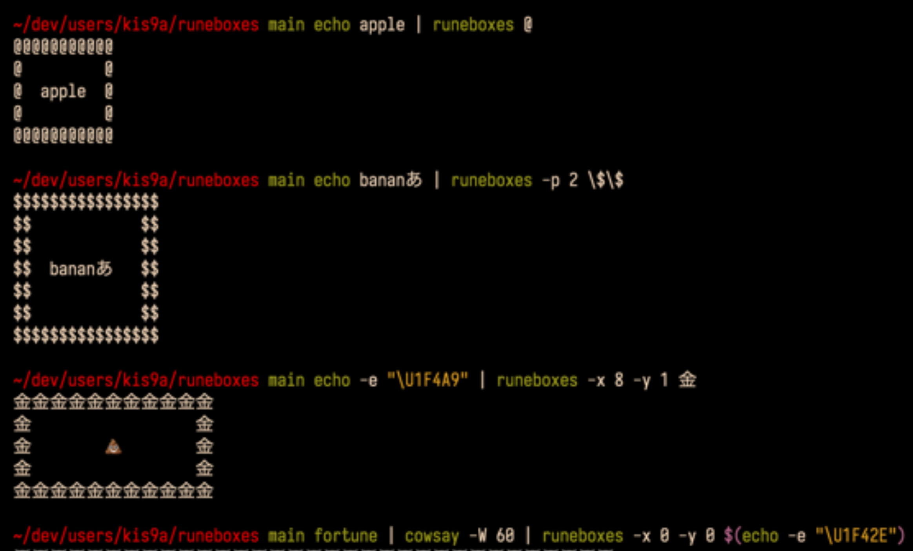

# runeboxes

Display the piped string in the character box.

## Image



## Required

runewidth command is required.  
runewidth "string" is return fixed width of the character "string".

I use [GitHub - mattn/go-runewidth: wcwidth for golang](https://github.com/mattn/go-runewidth) function as command line tool.  
See installation at <https://github.com/kis9a/go-runewidth#fork>

## Installation

```
sudo curl -s https://raw.githubusercontent.com/kis9a/runeboxes/main/runeboxes >/usr/local/bin/runeboxes
chmod +x /usr/local/bin/runeboxes
```

## Usage

```
USAGE:
  runeboxes [options] <box_char>

OPTIONS:
  -h: help
  -t: test: runeboxes_test
  -p: padding size
  -m, --margin: margin size
  -mx, --margin-x: horizontal margin size
  -my, --margin-y: vertical margin size
  -p, --padding: padding size
  -px, --padding-x: horizontal padding size
  -py, --padding-y: vertical padding size

EXAMPLE:
  echo apple | runeboxes @
  echo bananaあ | runeboxes -p 3 \$
  echo -e "\U1F4A9" | runeboxes -x 8 -y 2 金
  fortune | cowsay -W 60 | runeboxes -x 4 $(echo -e "\U1F4A9")
```

vim

```
:'<,'>!cat - | runeboxes
```

## Devtools

**Style guide**

> Indentation
> Indent 2 spaces. No tabs. Use blank lines between blocks to improve readability. Indentation is two spaces. Whatever you do, don’t use tabs. For existing files, stay faithful to the existing indentation.
> <https://google.github.io/styleguide/shellguide.html>

Linter: [GitHub - koalaman/shellcheck](https://github.com/koalaman/shellcheck)  
Formatter: [GitHub - mvdan/sh](https://github.com/mvdan/sh)
